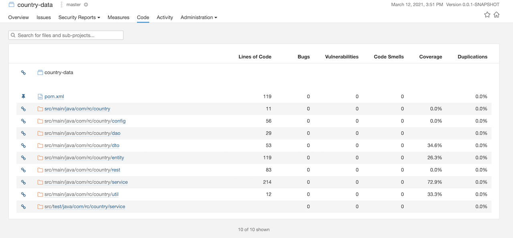

[](https://circleci.com/gh/askyora/country-data/tree/main)

## Country data API
##### JVM 11
`$ mvn -f jvm-pom.xml -B clean package`

##### Graal VM 
`$ mvn -f native-pom.xml spring-boot:build-image`


* Data validated in fail-fast way so before it saved to the database it will be validated for unsupported and empty
  values and duplicates.
* Hibernate is used for achieve a database independence.
* Exceptions managed in controller advice class.
* System prerequisites - {java 11 , Maven latest}

###### compile the program.

`$ mvn clean install`

###### to run.

`$ mvn spring-boot:run`

###### CURL with

`$ country-data % curl -w "@curl-format.txt" --location --request GET 'http://localhost:8080/data/AUS/GDP/2016'`

* local swagger url : http://localhost:8080/swagger-ui.html



### Reference Documentation
For further reference, please consider the following sections:

* [Official Apache Maven documentation](https://maven.apache.org/guides/index.html)
* [Spring Boot Maven Plugin Reference Guide](https://docs.spring.io/spring-boot/docs/2.6.2/maven-plugin/reference/html/)
* [Create an OCI image](https://docs.spring.io/spring-boot/docs/2.6.2/maven-plugin/reference/html/#build-image)
* [Spring Native Reference Guide](https://docs.spring.io/spring-native/docs/current/reference/htmlsingle/)
* [Spring Web](https://docs.spring.io/spring-boot/docs/2.6.2/reference/htmlsingle/#boot-features-developing-web-applications)
* [Spring Data JPA](https://docs.spring.io/spring-boot/docs/2.6.2/reference/htmlsingle/#boot-features-jpa-and-spring-data)
* [Spring Boot Actuator](https://docs.spring.io/spring-boot/docs/2.6.2/reference/htmlsingle/#production-ready)

### Guides
The following guides illustrate how to use some features concretely:

* [Building a RESTful Web Service](https://spring.io/guides/gs/rest-service/)
* [Serving Web Content with Spring MVC](https://spring.io/guides/gs/serving-web-content/)
* [Building REST services with Spring](https://spring.io/guides/tutorials/bookmarks/)
* [Accessing Data with JPA](https://spring.io/guides/gs/accessing-data-jpa/)
* [Building a RESTful Web Service with Spring Boot Actuator](https://spring.io/guides/gs/actuator-service/)

### Additional Links
These additional references should also help you:

* [Configure the Spring AOT Plugin](https://docs.spring.io/spring-native/docs/0.11.1/reference/htmlsingle/#spring-aot-maven)

## Spring Native

This project has been configured to let you generate either a lightweight container or a native executable.

### Lightweight Container with Cloud Native Buildpacks
If you're already familiar with Spring Boot container images support, this is the easiest way to get started with Spring Native.
Docker should be installed and configured on your machine prior to creating the image, see [the Getting Started section of the reference guide](https://docs.spring.io/spring-native/docs/0.11.1/reference/htmlsingle/#getting-started-buildpacks).

To create the image, run the following goal:

```
$ ./mvnw -f native-pom.xml spring-boot:build-image
```

Then, you can run the app like any other container:

```
$ docker run --rm -p 8080:8080 my-data:0.0.1-SNAPSHOT
```

### Executable with Native Build Tools
Use this option if you want to explore more options such as running your tests in a native image.
The GraalVM native-image compiler should be installed and configured on your machine, see [the Getting Started section of the reference guide](https://docs.spring.io/spring-native/docs/0.11.1/reference/htmlsingle/#getting-started-native-build-tools).

To create the executable, run the following goal:

```
$ ./mvnw -f native-pom.xml package -Pnative
```

### Author : R. A. Yohan Shanaka.
